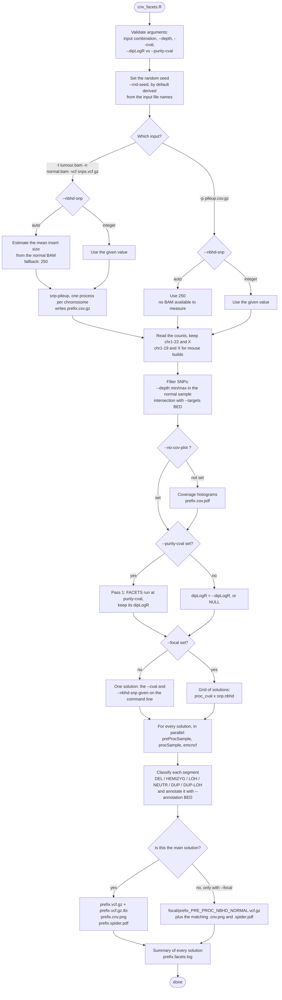

[](http://bioconda.github.io/recipes/cnv_facets/README.html)
[](https://travis-ci.com/dariober/cnv_facets)
[](https://codecov.io/gh/dariober/cnv_facets/branch/master)
[](https://cran.r-project.org/)
[](https://github.com/dariober/cnv_facets)

Detect somatic copy number variants (CNV) in tumour-normal samples using the
[facets](https://github.com/mskcc/facets) package

<!-- vim-markdown-toc GFM -->

- [Purpose](#purpose)
- [Quick start](#quick-start)
- [Requirements and Installation](#requirements-and-installation)
  - [Install via bioconda (recommended)](#install-via-bioconda-recommended)
  - [Install via setup script](#install-via-setup-script)
- [How it works](#how-it-works)
  - [Workflow at a glance](#workflow-at-a-glance)
  - [Step by step](#step-by-step)
    - [1. Argument validation](#1-argument-validation)
    - [2. Choice of the SNP neighbourhood](#2-choice-of-the-snp-neighbourhood)
    - [3. Random seed](#3-random-seed)
    - [4. Pileup: BAM input branch](#4-pileup-bam-input-branch)
    - [5. Loading and filtering the read counts](#5-loading-and-filtering-the-read-counts)
    - [6. Coverage histograms](#6-coverage-histograms)
    - [7. Two-pass purity run branch](#7-two-pass-purity-run-branch)
    - [8. Building the solution grid: focal branch](#8-building-the-solution-grid-focal-branch)
    - [9. Parallelism and memory budget](#9-parallelism-and-memory-budget)
    - [10. The FACETS core run](#10-the-facets-core-run)
    - [11. Segment classification and annotation](#11-segment-classification-and-annotation)
    - [12. Writing the outputs](#12-writing-the-outputs)
- [Input](#input)
  - [Option 1: BAM \& VCF input](#option-1-bam--vcf-input)
  - [Option 2: Pileup input](#option-2-pileup-input)
- [Command line arguments](#command-line-arguments)
  - [Output](#output)
  - [Input](#input-1)
  - [Pileup generation options](#pileup-generation-options)
  - [Site filtering](#site-filtering)
  - [Segmentation and model fitting](#segmentation-and-model-fitting)
  - [Genome build and annotation](#genome-build-and-annotation)
  - [Plots, reproducibility and info](#plots-reproducibility-and-info)
  - [Parameters fixed internally](#parameters-fixed-internally)
- [Output](#output-1)
  - [File names and the `focal` directory](#file-names-and-the-focal-directory)
  - [Variants](#variants)
    - [Fixed VCF columns](#fixed-vcf-columns)
    - [INFO tags](#info-tags)
    - [FILTER values](#filter-values)
    - [Header metadata](#header-metadata)
  - [Solution summary table](#solution-summary-table)
  - [CNV profile plot](#cnv-profile-plot)
  - [Histograms of depth of coverage](#histograms-of-depth-of-coverage)
  - [Diagnostic plot](#diagnostic-plot)
  - [Pileup file](#pileup-file)
  - [Error log](#error-log)
- [Usage guidelines](#usage-guidelines)
  - [Command options](#command-options)
  - [Filtering output for relevant CNVs](#filtering-output-for-relevant-cnvs)
- [Time and memory footprint](#time-and-memory-footprint)
- [Citation \& Getting help](#citation--getting-help)
- [Modifications](#modifications)

<!-- vim-markdown-toc -->

Purpose
=======

*cnv_facets* detects somatic copy number variants (CNVs), *i.e.*, variants
private to a tumour sample given a matched or unmatched normal sample.
*cnv_facets* uses next generation sequencing data from **whole genome (WGS)**,
**whole exome (WEX)** and **targeted (panel)** sequencing experiments. In
addition, it estimates tumour purity and ploidy. 

The core of *cnv_facets* is the
[facets](https://github.com/mskcc/facets) package by R Shen and VE Seshan
[FACETS: allele-specific copy number and clonal heterogeneity analysis tool for
high-throughput DNA sequencing, *Nucleic Acids Res*, 2016](https://www.ncbi.nlm.nih.gov/pmc/articles/PMC5027494/)

The advantage of *cnv_facets* over the original
[facets](https://github.com/mskcc/facets) package is the convenience of
executing all the necessary steps, from BAM input to VCF output, in a single
command line call.

Quick start
===========

Install with [mamba](https://github.com/mamba-org/mamba) from [bioconda](https://bioconda.github.io/recipes/cnv_facets/README.html) repository:

```
mamba install cnv_facets
```

Detect CNVs:

```
cnv_facets.R -t <tumour.bam> -n <normal.bam> -vcf <snps.vcf.gz> -o <output_prefix>
```

Get help:

```
cnv_facets.R -h
```

Requirements and Installation
=============================

`cnv_facets` runs on the Linux operating system. Windows is not supported 
and MacOS could work but some tweaks are necessary.

Install via bioconda (recommended)
----------------------------------

Installation via the [mamba](https://github.com/mamba-org/mamba) package manager is the
recommended route. Options `-c bioconda -c conda-forge` can be omitted if
bioconda and conda-forge are already registered channels (see below). 
It is generally not recommended to install packages in the conda base environment. Better to
install in a dedicated envirnment. E.g.:

```
mamba create -n my_project
mamba activate my_project
mamba install -c bioconda -c conda-forge cnv_facets
```

If the above fails with `mamba: command not found` or similar, install mamba first.
Follow the official
[documentation](https://mamba.readthedocs.io/en/latest/installation/mamba-installation.html) but
basically, these commands should suite most users:

```
curl -L -O "https://github.com/conda-forge/miniforge/releases/latest/download/Miniforge3-$(uname)-$(uname -m).sh"
bash Miniforge3-$(uname)-$(uname -m).sh

# Add some useful package repositories
mamba config --add channels defaults
mamba config --add channels bioconda
mamba config --add channels conda-forge
```

Install via setup script
------------------------

*cnv_facets* requires a reasonably recent version of
[R](https://cran.r-project.org/) on a Linux operating system. At the time of
this writing, it has been developed and deployed on R 3.5 on CentOS 7.

To compile and install execute:

```
bash setup.sh --bin_dir </dir/on/path>
```

Where `/dir/on/path` is a directory on your PATH where you have permission to
write, *e.g.*, `~/bin`.

How it works
============

`bin/cnv_facets.R` is a single command line wrapper that takes the analysis from
aligned reads (or from a pre-computed pileup) all the way to an indexed VCF of
copy number segments, plus diagnostic plots and a summary table. It does not
implement CNV detection itself: the statistics come from the
[facets](https://github.com/mskcc/facets) functions `preProcSample()`,
`procSample()` and `emcncf()`. What the script adds is:

* counting reference and alternate reads at polymorphic SNPs
  (`snp-pileup`, parallelised over chromosomes);
* depth- and target-based filtering of the SNPs that enter segmentation;
* an optional two-pass mode where a first, coarse run fixes the diploid log-ratio
  (`dipLogR`) that seeds a second, more sensitive run (`--purity-cval`);
* an optional grid search over segmentation parameters to expose focal events
  (`--focal`), with the solutions computed in parallel;
* translation of the FACETS segment table into an annotated, classified,
  bgzip-ed and tabix-indexed VCF.

There are five points at which the behaviour of the script branches: the type of
input (BAM *vs* pileup), how the SNP neighbourhood is chosen (`auto` *vs*
explicit), whether coverage plots are drawn, whether a preliminary purity run is
performed, and whether one or many parameter combinations are evaluated. The
diagram below shows those branches; the sections that follow describe each stage
in detail.

Workflow at a glance
--------------------



Step by step
------------

### 1. Argument validation

The script stops with a non-zero exit status if:

* neither `--pileup` nor both `--snp-tumour` and `--snp-normal` are given;
* `--snp-tumour` and `--snp-normal` point to the same file;
* BAM input is used without `--snp-vcf`;
* the minimum of `--depth` is larger than the maximum;
* the pre-processing critical value of `--cval` is larger than the processing one;
* both `--dipLogR` and `--purity-cval` are given (they are mutually exclusive,
  since both set the diploid log-ratio).

The output directory (`dirname` of `--out`) is created if it does not exist.

### 2. Choice of the SNP neighbourhood

`--nbhd-snp` accepts an integer or the string `auto` (the default).

* `auto` **with BAM input**: the mean insert size of the normal library is
  measured with `samtools stats` on up to 200,000 properly paired, primary reads
  from each of the ten most covered chromosomes, then averaged weighting by the
  number of properly paired reads. If no properly paired reads are found the
  fallback value 250 is used. The estimate is reported in the VCF header as
  `##estinsertsize`.
* `auto` **with pileup input**: there is no BAM to measure, so 250 is used.
* An integer is used as given; a non-integer, non-`auto` value is an error.

The resulting value is used both as the `--pseudo-snps` argument of `snp-pileup`
and as the `snp.nbhd` argument of `preProcSample()`.

### 3. Random seed

Runs are reproducible. The seed is taken from `--rnd-seed`:

* default (`"The name of the input file"`): the sum of the UTF-8 code points of
  the pileup path, or of the concatenated normal and tumour BAM paths;
* a numeric value: used directly;
* any other string: the sum of its UTF-8 code points.

The chosen seed is echoed to `stderr`. Note that `run_facets()` additionally
calls `set.seed(1234)` immediately before `preProcSample()`, so the segmentation
step itself is deterministic.

### 4. Pileup: BAM input branch

With BAM input the script writes the pileup to `<prefix>.csv.gz` and then
proceeds exactly as if that file had been supplied with `--pileup`. The list of
chromosomes is read from the tabix index of `--snp-vcf`, and one `snp-pileup`
job per chromosome is run in a fork cluster of `min(8, ceiling(--snp-nprocs / 2))`
workers. Each job streams the SNPs (`bcftools view`) and the two BAMs
(`samtools view`) through named pipes into `snp-pileup`, invoked as:

```
snp-pileup --gzip --pseudo-snps <nbhd-snp> \
           --min-map-quality <--snp-mapq> --min-base-quality <--snp-baq> \
           --max-depth 10000000 --min-read-counts 0,0 [--count-orphans] \
           <snps.vcf> <out.csv.gz> <normal.bam> <tumour.bam>
```

The normal sample is passed first, which is why it is `File1*` in the pileup.
The per-chromosome CSVs are then concatenated into a single gzipped file and the
temporary directory is removed.

### 5. Loading and filtering the read counts

The pileup is read keeping only the columns `Chromosome`, `Position`, `File1R`,
`File1A`, `File2R`, `File2A`. Total depths are computed as
`NOR.DP = File1R + File1A` and `TUM.DP = File2R + File2A`. Whether the input
used a `chr` prefix is recorded so that the same convention is restored in the
output; internally the prefix is stripped because FACETS needs numeric
chromosome names. Only the main chromosomes are kept: 1-22 and X for `hg19`
and `hg38`, 1-19 and X for `mm9` and `mm10`. If the pileup contains no
records at all the script exits with status 1.

Sites are then filtered on the **normal** sample depth,
`--depth[1] <= NOR.DP < --depth[2]` (the maximum is exclusive) and, if
`--targets` is given, on overlap with the target BED. If the pileup uses `chr`
names, the `chr` prefix is stripped from the BED as well so that the two match.

### 6. Coverage histograms

Unless `--no-cov-plot` is set, `<prefix>.cov.pdf` is drawn from the unfiltered
and the filtered site tables. Tables larger than 10 million rows are
down-sampled to 10 million rows for plotting, and depths above the 99th
percentile are capped, so the histograms stay legible. The unfiltered table is
released from memory immediately afterwards.

### 7. Two-pass purity run branch

If `--purity-cval` is set, a first complete FACETS run is performed with that
value as the processing critical value. Only one number is taken from it, the
fitted `dipLogR`, which is then passed to every subsequent run. The rationale
(borrowed from [facets-suite](https://github.com/mskcc/facets-suite)) is that a
coarse run gives a more robust estimate of the diploid level, and anchoring the
sensitive run to it avoids the sensitive run drifting to a wrong ploidy
solution.

If `--purity-cval` is not set, `dipLogR` is whatever `--dipLogR` says, or `NULL`,
in which case FACETS estimates it internally in each run.

### 8. Building the solution grid: focal branch

The pre-processing critical value is always `--cval[1]`. Without `--focal`, a
single solution is evaluated, using `--cval[2]` and the SNP neighbourhood from
step 2. With `--focal`, the script expands both parameters:

```
proc_cval : unique(c(cval[2], 30, 40, seq(50, max(250, ceiling(cval[2]/50)*50), 50)))
snp.nbhd  : unique(c(nbhd_snp, 30, 45, 60, seq(80, ceiling(nbhd_snp/40)*40, 40)))
```

so with the defaults (`--cval 25 150`, `nbhd_snp` 250) this gives the critical
values 150, 30, 40, 50, 100, 200, 250 and the neighbourhoods 250, 30, 45, 60,
80, 120, 160, 200, 240, 280 — a grid of 70 combinations. Smaller critical
values and smaller neighbourhoods both increase segmentation, which is what
makes short, focal events visible. The full grid is the cartesian product of
`proc_cval`, `snp.nbhd` and the single value of `--unmatched`.

### 9. Parallelism and memory budget

Before the grid is evaluated the script estimates the memory each worker needs
as `2 x sizeof(filtered pileup) + 1 GB`, reads the free RAM of the machine, and
uses

```
min(--snp-nprocs, floor(free RAM / memory per worker))
```

workers in a `future` multisession plan. This is why `--snp-nprocs` can be set
generously without risking an out-of-memory failure: the actual number of
workers is capped by the memory available. The chosen number is reported on
`stderr`.

### 10. The FACETS core run

Each solution runs `run_facets()`, which is a thin wrapper around three FACETS
calls in sequence:

1. `preProcSample()` — GC-normalises the log-ratios, calls heterozygous SNPs and
   performs the pre-segmentation at `pre_cval`;
2. `procSample()` — the actual joint segmentation at `proc_cval`, optionally with
   a fixed `dipLogR`;
3. `emcncf()` — the EM fit that assigns integer total (`tcn.em`) and lesser
   (`lcn.em`) copy number and a cellular fraction (`cf.em`) to each segment, and
   yields the sample-level purity and ploidy.

The resulting segment table is sorted by chromosome and start position.

### 11. Segment classification and annotation

Chromosome names are restored (23, or 20 for mouse, becomes `X`; the `chr`
prefix is re-added if the input had it) and each segment is assigned a type from
its integer copy numbers, in this order of precedence:

| Condition | `SVTYPE` |
|---|---|
| `TCN_EM == 2` and (`LCN_EM == 1` or missing) | `NEUTR` |
| `TCN_EM == 2` and `LCN_EM == 2` | `DUP` |
| `TCN_EM == 0` | `DEL` |
| `TCN_EM > 2` and (`LCN_EM > 0` or missing) | `DUP` |
| `TCN_EM == 1` | `HEMIZYG` |
| `TCN_EM == 2` and `LCN_EM == 0` | `LOH` |
| `TCN_EM > 2` and `LCN_EM == 0` | `DUP-LOH` |

See also [facets issue #62](https://github.com/mskcc/facets/issues/62). If
`--annotation` is given, the 4th column of that BED file is intersected with the
segments and the overlapping feature names are collected into `CNV_ANN`;
copy-number-neutral segments are left unannotated.

### 12. Writing the outputs

Every solution writes its own VCF, CNV profile plot and spider plot (see
[Output](#output-1) below). Segments shorter than 2 bp are dropped. Finally, one
row per solution is collected into `<prefix>.facets.log` and printed to
`stdout`, and `sessionInfo()` is written to `stderr`.

Input
=====

Option 1: BAM & VCF input
-------------------------

Required input files:

* A bam file of the **tumour** sample

* A bam file of the **normal** sample (typically, a blood
  sample from the same patient)

* A VCF file of common, polymorphic SNPs. For human samples, a good source is
  the dbSNP file
  [common_all.vcf.gz](https://www.ncbi.nlm.nih.gov/variation/docs/human_variation_vcf/). 
  See also NCBI [human variation sets in VCF Format](https://www.ncbi.nlm.nih.gov/variation/docs/human_variation_vcf/).

BAM and VCF files must be sorted and indexed. 

**USAGE**

```
cnv_facets.R -t <tumour.bam> -n <normal.bam> -vcf <snps.vcf.gz> -o <output_prefix> [...]
```

Option 2: Pileup input
----------------------

This pileup file is generated by `cnv_facets.R` when run with bam input as in
option 1. If you need to explore different parameter values for CNV detection, 
using a pre-made pileup file can save considerable computing time.

Internally, `cnv_facets.R` uses `snp-pileup`, a program installed together
with the *cnv_facets* package.

The pileup is a comma separated file of read counts for the reference and
alternate allele at polymorphic SNPs. This file must have the following columns
(order of columns is not important, additional columns are ignored):
 
 * *Chromosome* Chromosome of the SNP
 
 * *Position* Position of the SNP
 
 * *File1R* Read depth supporting the REF allele in **normal** sample
 
 * *File1A* Read depth supporting the ALT allele in **normal** sample
 
 * *File2R* Read depth supporting the REF allele in **tumour** sample
 
 * *File2A* Read depth supporting the ALT allele in **tumour** sample

These are the first lines of the test file `test/data/stomach.csv.gz`
accompanying the original facets package:

```
"Chromosome","Position","Ref","Alt","File1R","File1A","File1E","File1D","File2R","File2A","File2E","File2D"
1,69424,N,N,170,117,0,0,158,103,0,0
1,69515,N,N,0,76,0,0,0,77,0,0
1,69536,N,N,103,0,0,0,99,0,0,0
1,808866,N,N,96,0,0,0,133,0,0,0
1,809120,N,N,66,0,0,0,105,0,0,0
```

**USAGE**

```
cnv_facets.R -p <pileup.csv.gz> -o <output_prefix> [...]
```

Command line arguments
======================

This is the complete set of options accepted by `bin/cnv_facets.R`. The same
list, in condensed form, is printed by `cnv_facets.R --help`. Options prefixed
with `--snp-` are only used when the pileup has to be generated from BAM files;
they are ignored with `--pileup`.

Output
------

| Option | Type | Default | Description |
|---|---|---|---|
| `--out`, `-o` | string | **required** | Prefix for all output files. It may contain a directory component, which is created if missing. |

Input
-----

| Option | Type | Default | Description |
|---|---|---|---|
| `--snp-tumour`, `-t` | file | none | BAM file of the tumour sample. Sorted and indexed. Required unless `--pileup` is given, and must differ from `--snp-normal`. |
| `--snp-normal`, `-n` | file | none | BAM file of the normal sample. Sorted and indexed. Required unless `--pileup` is given. |
| `--snp-vcf`, `-vcf` | file | none | VCF of polymorphic SNPs at which the pileup is computed. Must be bgzip-ed and tabix-indexed; the chromosome list of the analysis is taken from its index. Required with BAM input. |
| `--pileup`, `-p` | file | none | Pre-computed pileup of read counts, *i.e.* the `<prefix>.csv.gz` file from an earlier run (or any `snp-pileup` output). Skips BAM processing entirely. It takes precedence over BAM input: if it is given, the `--snp-*` options are not used. |

Either `--pileup` **or** both `--snp-tumour` and `--snp-normal` (together with
`--snp-vcf`) must be supplied.

Pileup generation options
-------------------------

These are the `--snp-*` options. They are used only when the pileup is built
from BAM files and are ignored with `--pileup`.

| Option | Type | Default | Description |
|---|---|---|---|
| `--snp-mapq`, `-mq` | integer | `5` | Minimum mapping quality for a read to be counted (`snp-pileup --min-map-quality`). |
| `--snp-baq`, `-bq` | integer | `10` | Minimum base quality for a base to be counted (`snp-pileup --min-base-quality`). |
| `--snp-count-orphans`, `-A` | flag | off | Do not discard anomalous read pairs, *i.e.* pass `--count-orphans` to `snp-pileup`. |
| `--snp-nprocs`, `-N` | integer | `1` | Degree of parallelism. Chromosomes are distributed over `min(8, ceiling(N/2))` processes while building the pileup, and the FACETS solutions of the `--focal` grid over up to `N` background workers, further capped by the free RAM (see [Parallelism and memory budget](#9-parallelism-and-memory-budget)). |

Site filtering
--------------

| Option | Type | Default | Description |
|---|---|---|---|
| `--depth`, `-d` | 2 integers | `25 4000` | Minimum and maximum depth in the **normal** sample for a position to enter segmentation. The interval is closed on the left and open on the right (`min <= depth < max`). Use the coverage histograms to choose sensible values. |
| `--targets`, `-T` | file | none | BED file of target regions, *e.g.* the WEX or panel capture regions. Only SNPs overlapping a target are kept. Not required even for targeted sequencing, but it usually improves the results. If the pileup uses `chr` names, the prefix is stripped from the BED so the two conventions match. |

Segmentation and model fitting
------------------------------

| Option | Type | Default | Description |
|---|---|---|---|
| `--cval`, `-cv` | 2 doubles | `25 150` | Critical values for pre-processing and processing segmentation. The first must not exceed the second. Larger values give fewer, longer segments. `25 150` is the facets default for exome data; for WGS consider `25 400`, for panels lower values. |
| `--purity-cval`, `-pcv` | numeric | none | Enables the two-pass mode. A first run at this critical value estimates the segmentation, purity and ploidy; its `dipLogR` then seeds the run(s) performed with `--cval`, which may recover more focal events. Mutually exclusive with `--dipLogR`. |
| `--dipLogR` | numeric | none | Fix the log-ratio of the diploid state instead of letting FACETS estimate it. Mutually exclusive with `--purity-cval`. When set, its value is appended to the output file names. |
| `--nbhd-snp`, `-snp` | `auto` or integer | `auto` | If an interval of this size contains more than one SNP, one is sampled at random, which reduces SNP serial correlation. The value should be close to the median insert size of the libraries. With `auto` and BAM input the insert size is estimated from the normal BAM; with `auto` and pileup input, 250 is used. Reference points: 250 for exomes, ~500 for WGS, ~150 for panels. |
| `--unmatched`, `-u` | flag | off | The normal sample is not matched to the tumour. Heterozygous SNPs are then called from the tumour reads only (`het.thresh` 0.1 instead of 0.25) and the logOR is computed differently. |
| `--focal`, `-F` | flag | off | Evaluate a grid of segmentation parameters rather than a single combination, in order to expose focal events. See [Building the solution grid](#8-building-the-solution-grid-focal-branch) for the exact grid. Each extra combination produces its own VCF and plots under a `focal/` sub-directory. |

Genome build and annotation
---------------------------

| Option | Type | Default | Description |
|---|---|---|---|
| `--gbuild`, `-g` | `hg19`, `hg38`, `mm9`, `mm10` | `hg38` | Reference genome build. Determines which chromosomes are kept (1-22 and X for human, 1-19 and X for mouse), the GC-content model used by FACETS, and the contig lines of the output VCF header. |
| `--annotation`, `-a` | file | none | BED file whose 4th column holds a feature name (*e.g.* a gene symbol). Overlapping feature names are reported in `INFO/CNV_ANN`. Characters not allowed in a VCF INFO field are URL-encoded and spaces become underscores. |

Plots, reproducibility and info
-------------------------------

| Option | Type | Default | Description |
|---|---|---|---|
| `--no-cov-plot`, `-np` | flag | off | Skip the coverage histograms, which can be memory intensive on large WGS runs. The CNV profile and spider plots are still produced. |
| `--rnd-seed`, `-s` | string | name of the input file | Seed of the random number generator. A number is used as is; any other string, including the default, is converted to the sum of its UTF-8 code points. |
| `--version`, `-v` | flag | | Print the version of `cnv_facets.R` and of the underlying facets package, and exit. |
| `--help`, `-h` | flag | | Print the usage summary and exit. |

Parameters fixed internally
---------------------------

For reference, these FACETS parameters are not exposed on the command line:

* `preProcSample()`: `deltaCN = 0`, `ndepth = 1`, `ndepthmax = 1e8` (depth
  filtering is done by `--depth` on the input matrix instead),
  `het.thresh = 0.25` with a matched normal and `0.1` with `--unmatched`;
* `procSample()`: `min.nhet = 15`;
* `emcncf()`: `unif = FALSE`, `min.nhet = 15`, `maxiter = 20`, `eps = 1e-3`;
* `snp-pileup`: `--max-depth 10000000`, `--min-read-counts 0,0`.

Output
======

The option `--out/-o <prefix>` determines the name and location of the output
files. For more information refer to the documentation of the
[facets](https://github.com/mskcc/facets) package.

File names and the `focal` directory
------------------------------------

A default run produces one set of files named after the prefix:

```
<prefix>.csv.gz          # only with BAM input
<prefix>.vcf.gz
<prefix>.vcf.gz.tbi
<prefix>.cnv.png
<prefix>.spider.pdf
<prefix>.cov.pdf         # unless --no-cov-plot
<prefix>.facets.log
```

The solution that uses exactly the parameters requested on the command line is
the **main solution** and owns the plain `<prefix>.*` names. When `--focal` is
used, every other combination of the grid is written to a `focal/`
sub-directory next to the main output, with the parameters encoded in the name:

```
<outdir>/focal/<basename>_<pre_cval>_<proc_cval>_<nbhd_snp>_<matchednormal|unmatchednormal>.vcf.gz
```

If `--dipLogR` is given, its value is appended to the name of every file,
including the main solution, *e.g.* `<prefix>_-0.15.vcf.gz`.

Variants
--------

* `<prefix>.vcf.gz` and its tabix index `<prefix>.vcf.gz.tbi`

A bgzip-compressed, indexed VCF 4.2 file with one record per copy number
segment, including copy-number-neutral ones. Segments shorter than 2 bp are
omitted. There is no sample column: the file carries the segments in the
INFO field only.

### Fixed VCF columns

| Column | Content |
|---|---|
| `CHROM` | Chromosome of the segment, with the same naming convention (`chr` prefix or not) as the input pileup. |
| `POS` | Start of the segment, 1-based (the 0-based FACETS start plus one). |
| `ID` | Segment number assigned by FACETS (`seg`). |
| `REF` | Always `N`. |
| `ALT` | Always the symbolic allele `<CNV>`. |
| `QUAL` | Always `.`. |
| `FILTER` | `neutral` for copy-number-neutral segments, `PASS` for everything else. |
| `INFO` | The tags below. |

### INFO tags

Tag | Type | Description
----|------|------------
SVTYPE | String | Type of structural variant: one of `DEL`, `HEMIZYG`, `LOH`, `NEUTR`, `DUP`, `DUP-LOH`, as assigned from `TCN_EM`/`LCN_EM` by the rules in [Segment classification](#11-segment-classification-and-annotation)
SVLEN | Integer | Difference in length between REF and ALT alleles, *i.e.* `END - start` of the segment
END | Integer | End position of the variant described in this record
NUM_MARK | Integer | Number of SNPs in the segment
NHET | Integer | Number of SNPs that are deemed heterozygous
CNLR_MEDIAN | Float | Median log-ratio (logR) of the segment. logR is defined by the log-ratio of total read depth in the tumor versus that in the normal
CNLR_MEDIAN_CLUST | Float | Median log-ratio (logR) of the segment cluster. logR is defined by the log-ratio of total read depth in the tumor versus that in the normal
MAF_R | Float | Log-odds-ratio (logOR) summary for the segment. logOR is defined by the log-odds ratio of the variant allele count in the tumor versus in the normal
MAF_R_CLUST | Float | Log-odds-ratio (logOR) summary for the segment cluster. logOR is defined by the log-odds ratio of the variant allele count in the tumor versus that in the normal
SEGCLUST | Integer | Segment cluster to which the segment belongs
CF_EM | Float | Cellular fraction, fraction of DNA associated with the aberrant genotype. Set to 1 for normal diploid. See also issue [#17](https://github.com/dariober/cnv_facets/issues/17)
TCN_EM | Integer | Total copy number. 2 for normal diploid
LCN_EM | Integer | Lesser (minor) copy number. 1 for normal diploid
CNV_ANN | String | Comma-separated list of features from `--annotation` overlapping this CNV. `.` if there is no annotation file, no overlap, or the segment is copy-number-neutral

Float tags are rounded to three decimals and missing values are written as `.`.

### FILTER values

Tag | Description
----|------------
PASS | All filters passed, *i.e.* the segment is not copy-number-neutral
neutral | Copy number neutral (`SVTYPE=NEUTR`)

### Header metadata

Besides `##fileformat`, `##reference`, the `##contig` lines for the chosen
build, and the `##INFO`/`##FILTER`/`##ALT` definitions, the header records the
full command line, the version of `cnv_facets.R` and of facets, the date, and
the following run-specific keys:

Key | Description
----|------------
`##mainsolution` | `TRUE` for the solution matching the requested parameters, `FALSE` for the extra `--focal` solutions
`##purity` | Tumour purity estimated by `emcncf()`. Reported as `0.1` when the fit returns `NA`
`##ploidy` | Tumour ploidy estimated by `emcncf()`
`##dipLogR` | Log-ratio of the diploid state used or fitted for this solution
`##emflags` | Warning flags emitted by `emcncf()` about the quality of the fit
`##estinsertsize` | Insert size estimated from the normal BAM when `--nbhd-snp auto` is used; `NA` otherwise
`##prepuritycval` | Value of `--purity-cval`, or the string `No preliminary cval`
`##precval` | Pre-processing critical value actually used (`--cval[1]`)
`##proccval` | Processing critical value actually used for this solution
`##snpnbhd` | SNP neighbourhood actually used for this solution
`##usersnpnbhd` | Value of `--nbhd-snp` as given on the command line, *e.g.* `auto`
`##matchednormal` | `TRUE` unless `--unmatched` was set
`##tumorsample` | Tumour BAM file name without extension, or the pileup file name with pileup input
`##normalsample` | Normal BAM file name without extension, or the pileup file name with pileup input

Solution summary table
----------------------

* `<prefix>.facets.log`

A space-separated table with one row per solution — a single row for a default
run, one row per grid point with `--focal`. The same table is printed to
`stdout` at the end of the run, which makes it the quickest way to compare
solutions and pick the parameters worth keeping. Columns:

Column | Description
-------|------------
`main_solution` | `TRUE` for the solution that used the requested parameters
`purity_cval` | Value of `--purity-cval`, or `No preliminary cval`
`pre_cval` | Pre-processing critical value used
`proc_cval` | Processing critical value used
`SNP_density` | SNP neighbourhood used
`dipLogR` | Fitted or supplied log-ratio of the diploid state
`estimated_insert_size` | Insert size estimated from the normal BAM, or `NA`
`user_pre_cval` | Pre-processing critical value requested on the command line
`user_proc_cval` | Processing critical value requested on the command line
`user_SNP_density` | Value of `--nbhd-snp` as given on the command line
`ploidy` | Estimated tumour ploidy
`purity` | Estimated tumour purity
`n_segments` | Number of segments in this solution
`matched_normal` | `TRUE` unless `--unmatched` was set
`emflags` | Warning flags from `emcncf()`

CNV profile plot
----------------

* `<prefix>.cnv.png`

Summary plot of CNVs across the genome, 1600 x 1600 px at 300 dpi, produced by
`facets::plotSample()`. The panels show, from top to bottom, the log-ratio, the
log-odds-ratio, and the fitted integer and allele-specific copy number along the
genome. The title carries the file name, the estimated ploidy and the estimated
purity. For [example](./docs/tex.cnv.png):


Histograms of depth of coverage
------------------------------

* `<prefix>.cov.pdf`

Histograms of the distribution of read depth (coverage) across all the position
in the tumour and normal sample, before (red, "All positions") and after (blue,
"Filtered positions") filtering positions. The number of sites in each panel is
given in the facet label, depths are capped at the 99th percentile, and very
large tables are down-sampled to 10 million sites. These plots are useful to
assess whether the sequencing depth and depth of covarage thresholds are
appropriate. Not produced with `--no-cov-plot`.


Diagnostic plot
---------------

* `<prefix>.spider.pdf`

This is a diagnostic plot to check how well the copy number fits
work The estimated segment summaries are plotted as circles
where the size of the circle increases with the number of loci in
the segment. The expected value for various integer copy number
states are drawn as curves for purity ranging from 0 to 0.95. For
a good fit, the segment summaries should be close to one of the
lines. (*Description from `facets::logRlogORspider`*). For [example](./docs/tex.spider.png):


Pileup file
-----------

* `<prefix>.csv.gz`

File of nucleotide counts at each SNP in normal and tumour sample, written only
when the run started from BAM files. It is a gzipped CSV in `snp-pileup` format
and can be fed back to a later run with `--pileup`, which skips the most
expensive part of the analysis. Columns: `Chromosome`, `Position`, `Ref`, `Alt`,
then for each sample — `File1*` for the **normal**, `File2*` for the
**tumour** — the counts of reads supporting the reference (`R`), the alternate
allele (`A`), errors (`E`) and deletions (`D`).

Error log
---------

* `<prefix>.facets.err.log`

Written only if a segment cannot be converted to a VCF record. It contains the
neighbourhood of the offending rows of the FACETS segment table, and a warning
naming the segment is printed on `stderr`.

Usage guidelines
================

Command options
---------------

* `--depth`

Use the histograms of depth to set appropriate thresholds. Consider also the option
`--targets` for targeted sequence libraries.

* `--cval`

Critical values for segmentation in pre-processing and processing.
Larger values reduce segmentation. [25 150] is facets default based on exome data. For whole genome
consider increasing to [25 400] and for targeted sequencing consider reducing them. Default 25 150

* `--nbhd-snp`

If an interval of size nbhd-snp contains more than one SNP, sample a random one.
This sampling reduces the SNP serial correlation. This value should be similar
to the median insert size of the libraries. 250 is facets default based on
exome data. For whole genome consider increasing to 500 and for target
sequencing decrease to 150. The default `auto` estimates it from the normal BAM
file when BAM input is used, and falls back to 250 otherwise.

* `--focal`

Useful when short, focal events are expected to be missed by a single
parameter combination. It multiplies the run time by the number of grid points,
so combine it with a generous `--snp-nprocs`, and use `<prefix>.facets.log` to
decide which of the solutions in `focal/` is worth keeping.

* `--purity-cval`

Prefer this over `--dipLogR` when the diploid level is uncertain: it derives the
value from the data instead of requiring you to supply it.

Filtering output for relevant CNVs 
----------------------------------

* CNLR_MEDIAN_CLUST

USe this VCF tag to filter for records where the difference in read depth
coverage between tumour and normal. The tag `CNLR_MEDIAN` should be well
correlated with `CNLR_MEDIAN_CLUST` so using one or the other should not make
much difference. Use the plot of CNV profile, log-ratio panel of
`<prefix>.cnv.png` to decide on a sensible thresholds.

* MAF_R_CLUST

Use this VCF tag to filter for CNVs significant difference in tumour allele
frequency. Use the plot of CNV profile, log-odds-ratio panel of `<prefix>.cnv.png`
to decide on a sensible thresholds. As above MAF_R_CLUST is correlated with MAF_R.

Time and memory footprint
=========================

The analysis of a whole genome sequence where the
tumour is sequenced at ~80x (~2 billion reads, BAM file ~200 GB) and the normal
at ~40x (~1 billion reads, BAM files ~100 GB) with ~37 million SNPs (from dbSNP
`common_all_20180418.vcf.gz`) and with no filtering on read depth and read
quality requires:

* 5 hours to prepare the SNP pileup with small memory footprint. Time is mostly
  driven by the size of the BAM files. To speed-up the pileup consider the 
  option `--snp-nprocs` to parallelize across chromosomes.

* 1 hour and ~15 GB of memory for the actual detection of CNVs starting from
  the pileup. Time and memory is mostly driven by the number of SNPs

With `--focal` the CNV detection step is repeated for every grid point. The
solutions run concurrently, but each worker holds its own copy of the filtered
pileup, so the number of workers is capped at
`floor(free RAM / (2 x pileup size + 1 GB))` regardless of `--snp-nprocs`.

Citation & Getting help
=======================

If using *cnv_facets* please cite 

* the URL of this repository and 

* The publication of the facets package [FACETS: allele-specific copy
  number and clonal heterogeneity analysis tool for high-throughput DNA
  sequencing, *Nucleic Acids Res*,
  2016](https://www.ncbi.nlm.nih.gov/pmc/articles/PMC5027494/)

Any and all comment and questions can be sent to one or more of the following
recipients:

* Open an issue at [github.com/dariober/cnv_facets)](https://github.com/dariober/cnv_facets/issues) 

* For questions specific to the FACETS package and CNV calling open an issue at
  [https://github.com/ddmskcc/facets](https://github.com/mskcc/facets/issues)

* Post a question at https://www.biostars.org/ (you may want to notify me by
  sending an email to `dario <dot> beraldi <at> gmail <dot> com`)


Modifications
========

The following modifications were introduced by K.Mavrommatis.

* introduce the parameter `--purity-cval`: 
When this value is set it allows for running FACETS in a two-pass mode, 
where first a "purity" run estimates the overall segmentation profile,
sample purity and ploidy, and subsequently the dipLogR value from this run 
seeds a "high-sensitivity" run which may detect more focal events.
This is a suggestion found in https://github.com/mskcc/facets-suite. 
The default value is NULL i.e. this step is ommited. 

* introduce the parameter `--focal`: runs a grid of segmentation parameters
(`proc_cval` x `snp.nbhd`) in parallel and writes the additional solutions to a
`focal/` sub-directory, so that focal events missed by a single parameter
combination can be recovered.

* introduce the parameter `--no-cov-plot` to skip the memory-intensive coverage
histograms, and `--dipLogR` to fix the diploid log-ratio explicitly.

* `--nbhd-snp` now accepts `auto` (the default), which estimates the SNP
neighbourhood from the insert size of the normal BAM file.

* the solutions are evaluated in parallel with `future`, with the number of
workers limited by the free RAM, and a per-run summary table is written to
`<prefix>.facets.log`.
